# Task Breakdown — Blog cá nhân về lập trình

**Version:** 1.0 | **Date:** 2026-06-14 | **Status:** Approved
**Nguồn:** [SRS](030_srs.md) | [TAD](040_tad.md) | [API Design](050_api_design.md) | [DB Design](060_db_design.md)
**Convention:** [070_coding_convention.md](070_coding_convention.md)

---

## Tổng quan

| Wave | Tên | Số task | Có thể song song |
|------|-----|---------|-----------------|
| 0 | Setup & Config | 2 | 2 |
| 1 | Types & Schema | 2 | 2 |
| 2 | Core Modules | 6 | 3 (2B + 2A một phần) |
| 3 | UI + API Routes | 15 | 15 |
| 4 | SEO + Search + PWA + Interactive | 14 | 14 |
| 5 | Analytics + Hardening | 4 | 4 |
| **Total** | | **43** | |

---

## Wave 0 — Setup & Config

> Mọi task khác depend on Wave 0. Hai task này làm song song được.

---

### T-001: Project Bootstrap

| Field | Value |
|-------|-------|
| **Wave** | 0 |
| **Refs** | REQ-BUILD-001, REQ-SEC-003 |
| **Depends on** | — |

**Implement:**

Tạo các file cấu hình tại project root:

- `package.json` — scripts: `dev`, `build`, `start`, `lint`, `test`, `test:watch`, `sync` (`tsx scripts/sync.ts`); dependencies theo danh sách approved trong `070_coding_convention.md §10.1`
- `next.config.ts` — `images.remotePatterns`: `*.public.blob.vercel-storage.com`, `*.amazonaws.com`
- `tsconfig.json` — `strict: true`, `noUncheckedIndexedAccess: true`, `noImplicitReturns: true`, `paths: {"@/*": ["./src/*"]}`
- `postcss.config.mjs` — plugin `@tailwindcss/postcss`
- `vitest.config.ts` — `globals: true`, `environment: 'node'`, `setupFiles: ['__tests__/setup.ts']`, alias `@` → `./src`
- `eslint.config.mjs` — extends `next/core-web-vitals`, `next/typescript`; rules theo `070_coding_convention.md §7.1`
- `.prettierrc` — `semi: false`, `singleQuote: true`, `plugins: ["prettier-plugin-tailwindcss"]`
- `.env.example` — 9 env vars với placeholder (không có giá trị thật): `NOTION_API_KEY`, `NOTION_DATABASE_ID`, `NOTION_WEBHOOK_SECRET`, `GITHUB_TOKEN`, `GITHUB_REPO`, `CRON_SECRET`, `SYNC_SECRET`, `DRAFT_SECRET`, `RESEND_API_KEY`
- `content/posts/.gitkeep` — giữ thư mục trong git
- `.vscode/settings.json` + `.vscode/extensions.json` — theo `070_coding_convention.md §7.3–7.4`
- `__tests__/setup.ts` — import `@testing-library/jest-dom`

Chạy `npm install`, verify `npm run build` không lỗi (dù chưa có src).

**DoD / Verify:** `npm install` thành công; `npx tsc --noEmit` không lỗi; `npm run lint` không lỗi.

---

### T-002: Vercel Deploy Config

| Field | Value |
|-------|-------|
| **Wave** | 0 |
| **Refs** | REQ-FUNC-015 (daily cron), TAD AD-04 |
| **Depends on** | — |

**Implement:**

Tạo `vercel.json`:

```json
{
  "crons": [
    { "path": "/api/cron-sync", "schedule": "0 2 * * *" }
  ]
}
```

Ghi chú: Vercel Cron chỉ hoạt động trên Vercel platform (không chạy local). `0 2 * * *` = 2:00 AM UTC hằng ngày (TAD AD-04).

**DoD / Verify:** File tồn tại, JSON valid. Sau deploy: Vercel dashboard → Cron Jobs tab hiển thị 1 job `/api/cron-sync`.

---

## Wave 1 — Types & Schema

> Hai task song song nhau. Đây là "hợp đồng" mà mọi module Wave 2+ phụ thuộc.

---

### T-010: PostFrontmatter & Post Types

| Field | Value |
|-------|-------|
| **Wave** | 1 |
| **Refs** | DB Design §3.1, §3.2 |
| **Depends on** | T-001 |

**Implement:**

Tạo `src/types/post.ts`:

```typescript
export interface PostFrontmatter {
  title: string
  slug: string
  status: 'published' | 'archived'
  tags: string[]
  date: string | null                 // YYYY-MM-DD
  excerpt: string | null
  cover: string | null                // Vercel Blob URL
  notionPageId: string
  notionLastEditedTime: string        // ISO 8601 UTC
  viewCount: number                   // default 0
}

export interface Post extends PostFrontmatter {
  content: string                     // MDX content string
}
```

Tất cả fields map trực tiếp từ DB Design §3.2 (MDX frontmatter data dictionary). `status` chỉ có 2 giá trị — Draft không được sync ra file (DB Design §3.3).

**DoD / Verify:** `npx tsc --noEmit` pass; file import được từ module khác.

---

### T-011: Notion Client & Property Helpers

| Field | Value |
|-------|-------|
| **Wave** | 1 |
| **Refs** | DB Design §2.1, §2.2, TAD §5.2 |
| **Depends on** | T-001 |

**Implement:**

Tạo `src/lib/notion-sync/client.ts`:

- Singleton `Client` từ `@notionhq/client`, khởi tạo với `process.env.NOTION_API_KEY` — throw `Error('Missing NOTION_API_KEY')` nếu không có (fail fast).
- Helper functions cho từng Notion property type (map từ DB Design §2.1):
  - `getTextProp(prop): string` — rich_text / title
  - `getSelectProp(prop): string | null` — select
  - `getMultiSelectProp(prop): string[]` — multi_select
  - `getDateProp(prop): string | null` — date → YYYY-MM-DD string
  - `getFileProp(prop): string | null` — files & media → first file URL

Export: `getNotionClient(): Client` (singleton), 5 helper functions.

**DoD / Verify:** `npx tsc --noEmit` pass. Unit test: mock property objects theo Notion API response shape → helpers trả đúng giá trị / null.

---

## Wave 2 — Core Modules

> **Wave 2A** (Sync Pipeline): sequential nội bộ — T-020 và T-021 song song; T-022 sau T-020+T-021; T-023 sau T-022.
> **Wave 2B** (Content Layer): T-024 chỉ phụ thuộc Wave 1, song song hoàn toàn với Wave 2A.

---

### T-020: Notion → Markdown Converter

| Field | Value |
|-------|-------|
| **Wave** | 2A |
| **Refs** | TAD §5.2 (`convert.ts`), REQ-FUNC-006 (syntax highlighting) |
| **Depends on** | T-011 |

**Implement:**

Tạo `src/lib/notion-sync/convert.ts`:

- Singleton `NotionToMarkdown` từ `notion-to-md`, nhận `notionClient` từ T-011.
- Export `pageToMarkdown(pageId: string): Promise<string>` — gọi `n2m.pageToMarkdown(pageId)` → `n2m.toMarkdownString(blocks)` → trả string markdown.
- Xử lý lỗi: wrap trong try/catch, throw với message có pageId để caller có context.

**DoD / Verify:** Unit test với mock Notion client trả block tree đơn giản → `pageToMarkdown` trả markdown string đúng format.

---

### T-021: Image Re-hosting (Notion → Vercel Blob)

| Field | Value |
|-------|-------|
| **Wave** | 2A |
| **Refs** | TAD §5.2 (`images.ts`), DB Design §5.1, AD-08 |
| **Depends on** | T-011 |

**Implement:**

Tạo `src/lib/notion-sync/images.ts`:

- `reHostImage(notionUrl: string, pathname: string): Promise<string>` — download ảnh từ Notion signed URL → upload lên Vercel Blob với path `posts/<slug>/<filename>` → trả Blob URL permanent.
  - Dev fallback: nếu `!process.env.BLOB_READ_WRITE_TOKEN` → return `notionUrl` nguyên (không throw).
- `reHostMarkdownImages(markdown: string, slug: string): Promise<string>` — regex tìm tất cả URL ảnh trong markdown (`amazonaws.com`, `prod-files-secure.s3`...) → gọi `reHostImage` cho từng URL → replace trong markdown.
  - Dùng `Array.from(markdown.matchAll(...))` (không spread iterator).
- Import `put` từ `@vercel/blob`.

**DoD / Verify:** Unit test với `BLOB_READ_WRITE_TOKEN` unset → `reHostImage` trả lại URL gốc. Integration test (optional): upload ảnh thật → verify URL public accessible.

---

### T-022: syncPost — Sync 1 Bài Viết

| Field | Value |
|-------|-------|
| **Wave** | 2A |
| **Refs** | TAD §5.2 (`syncPost.ts`), DB Design §3.3, REQ-REL-001, REQ-OBS-001, REQ-FUNC-014, REQ-FUNC-029 |
| **Depends on** | T-020, T-021, T-010 |

**Implement:**

Tạo `src/lib/notion-sync/syncPost.ts`:

**`syncPageObject(page: PageObjectResponse): Promise<'synced' | 'skipped'>`** — production entry point:

1. Extract properties từ `page.properties` dùng helpers từ T-011:
   - `title`, `slug`, `status` (select: `Published` → `'published'`, `Archived` → `'archived'`; Draft → skip ngay, trả `'skipped'`), `tags`, `date`, `excerpt`, cover URL
2. Đọc `notionLastEditedTime = page.last_edited_time`
3. Đọc file MDX hiện có tại `POSTS_DIR/<slug>.mdx` (nếu tồn tại):
   - Parse frontmatter bằng `gray-matter`
   - Nếu `existingFrontmatter.notionLastEditedTime === page.last_edited_time` → trả `'skipped'` (idempotent — REQ-FUNC-014 AC2)
   - Giữ `viewCount = existingFrontmatter.viewCount ?? 0`
4. Fetch markdown: `pageToMarkdown(page.id)` (T-020)
5. Re-host images: `reHostMarkdownImages(markdown, slug)` (T-021) — nếu lỗi → throw (abort bài, REQ-REL-001)
6. Build frontmatter YAML string:
   ```
   title, slug, status, tags (quoted), date, excerpt, cover, notionPageId, notionLastEditedTime, viewCount
   ```
   Tags phải được quote: `  - "${tag}"` (tránh YAML injection).
7. Ghi file `<POSTS_DIR>/<slug>.mdx` = frontmatter + content
8. Commit qua GitHub Contents API (`GITHUB_TOKEN`, `GITHUB_REPO`): PUT `/repos/<owner>/<repo>/contents/content/posts/<slug>.mdx` với message `"content: sync <slug>"`
9. Log JSON: `{ timestamp, trigger: 'manual', pageId, slug, result: 'synced', durationMs }` (REQ-OBS-001)
10. Trả `'synced'`

`POSTS_DIR` = `process.env.POSTS_DIR ?? path.join(process.cwd(), 'content/posts')` (test isolation).

Không export default. Named exports: `syncPageObject`.

**DoD / Verify:** 3 unit tests (dùng temp dir + vi.stubEnv):
- Ghi MDX mới khi page chưa tồn tại.
- Skip khi `notionLastEditedTime` giống nhau.
- Cập nhật khi `notionLastEditedTime` mới hơn; preserve `viewCount`.

---

### T-023: syncAll — Đồng bộ Toàn bộ Bài

| Field | Value |
|-------|-------|
| **Wave** | 2A |
| **Refs** | TAD §5.2 (`syncAll.ts`), DB Design §4.1, REQ-FUNC-015, REQ-REL-002, REQ-OBS-001, TAD AD-04 |
| **Depends on** | T-022 |

**Implement:**

Tạo `src/lib/notion-sync/syncAll.ts`:

```typescript
export interface SyncResult {
  synced: number
  skipped: number
  failed: number
  failedSlugs: string[]
  syncedAt: string  // ISO 8601 UTC
}

export async function syncAll(sinceTimestamp?: string): Promise<SyncResult>
```

Logic:
1. Query Notion database `NOTION_DATABASE_ID`:
   - Filter: `Status = Published OR Status = Archived`
   - Nếu `sinceTimestamp` có → thêm filter `last_edited_time.after: sinceTimestamp`
   - Paginate: vòng lặp `has_more` + `next_cursor` cho đến hết (xử lý database lớn)
2. Với mỗi page: gọi `syncPageObject(page)` trong try/catch:
   - `'synced'` → `results.synced++`
   - `'skipped'` → `results.skipped++`
   - Error → log JSON lỗi + `results.failed++` + `results.failedSlugs.push(slug)` — không abort (REQ-REL-002)
3. `syncedAt = new Date().toISOString()`
4. Trả `SyncResult`

Import: `getNotionClient()` từ T-011, `syncPageObject` từ T-022.

**DoD / Verify:** 2 unit tests (mock Notion client + mock syncPageObject):
- Sync 3 pages thành công → `{synced: 3, skipped: 0, failed: 0}`.
- Bài thứ 2 throw → `{synced: 2, failed: 1, failedSlugs: ['slug2']}` — bài 1 và 3 vẫn sync.

---

### T-024: Content Layer — Đọc & Parse MDX

| Field | Value |
|-------|-------|
| **Wave** | 2B |
| **Refs** | DB Design §3.1–3.3, REQ-FUNC-001, REQ-FUNC-002, REQ-FUNC-003, REQ-BUILD-001 |
| **Depends on** | T-010 |

**Implement:**

Tạo `src/lib/posts.ts`:

```typescript
const POSTS_DIR = process.env.POSTS_DIR ?? path.join(process.cwd(), 'content/posts')
const PER_PAGE = 10

// Lookup by filename (O(1)) — tên file = slug (DB Design §3.3)
export function getPost(slug: string): Post | null
export function getAllSlugs(): string[]           // từ filenames
export function getAllPosts(): PostFrontmatter[]  // chỉ status='published', sort date desc
export function paginatePosts(posts: PostFrontmatter[], page: number): {
  posts: PostFrontmatter[]
  currentPage: number
  totalPages: number
}
```

Quy tắc:
- `getPost`: đọc `<POSTS_DIR>/<slug>.mdx` trực tiếp (không scan tất cả files).
- `getAllSlugs`: `fs.readdirSync(POSTS_DIR)` → filter `.mdx` → `.replace(/\.mdx$/, '')`.
- `getAllPosts`: gọi `getAllSlugs()` → `getPost(slug)` → filter `status === 'published'` → sort `date` desc (fallback `'1970-01-01'` nếu null) bằng `localeCompare` trên ISO string.
- Malformed file: `console.warn` + skip (không throw).
- Không gọi Notion API ở bất kỳ điểm nào (REQ-BUILD-001).

**DoD / Verify:** 7 unit tests (vi.stubEnv + temp dir + fixture MDX files):
- `getPost` trả Post cho slug tồn tại.
- `getPost` trả null cho slug không tồn tại.
- `getAllPosts` chỉ trả published, sort đúng thứ tự.
- `getAllPosts` exclude archived.
- `paginatePosts` trả đúng trang.
- `getAllSlugs` từ filenames.
- `console.warn` khi file malformed.

---

### T-025: Sync CLI Script

| Field | Value |
|-------|-------|
| **Wave** | 2A (sau T-023) |
| **Refs** | TAD §5.2, REQ-FUNC-028 |
| **Depends on** | T-023 |

**Implement:**

Tạo `scripts/sync.ts`:

```typescript
async function main() {
  console.log('[sync] Starting full sync...')
  const sinceTimestamp = process.argv[2]
  try {
    const result = await syncAll(sinceTimestamp)
    console.log(`[sync] Done: ${result.synced} synced, ${result.skipped} skipped, ${result.failed} failed`)
    if (result.failed > 0) process.exit(1)
  } catch (err) {
    console.error('[sync] Fatal error:', err instanceof Error ? err.message : err)
    process.exit(1)
  }
}
main()
```

Chạy bằng `npm run sync` (`tsx scripts/sync.ts`). Argument `process.argv[2]` là optional ISO timestamp cho incremental sync.

**DoD / Verify:** `npm run sync` với `NOTION_API_KEY=""` (không có KV/Blob) không crash ở import level; nếu thiếu env → in lỗi rõ ràng và exit 1.

---

## Wave 3 — UI Pages, Components & API Routes

> Tất cả 15 tasks có thể làm SONG SONG sau khi Wave 1+2 xong. Chú ý dependency nội bộ: T-030 (layout) trước các page/component.

---

### T-030: Root Layout + Geist Design System

| Field | Value |
|-------|-------|
| **Wave** | 3 |
| **Refs** | REQ-FUNC-007 (theme), TAD §8.5, SRS §2.3 (Geist) |
| **Depends on** | T-001 |

**Implement:**

`src/app/globals.css`:
- Tailwind v4 directive `@import "tailwindcss"`
- CSS custom properties (Geist tokens): `--background`, `--foreground`, `--gray-100/200/400/600/800`, `--border`, `--font-sans`, `--font-mono`
- `.dark {}` overrides cho dark mode (class strategy)
- Prose styles cho MDX content: `h1-h4`, `p`, `code`, `pre`, `blockquote`, `ul/ol`

`src/app/layout.tsx`:
- Import `GeistSans`, `GeistMono` từ `geist/font`
- Root `<html lang="vi">` với font variables `${GeistSans.variable} ${GeistMono.variable}`
- `ThemeProvider` từ `next-themes` (strategy: `'class'`)
- Header: link về trang chủ + nav (`/about`, ThemeToggle placeholder)
- Footer: copyright
- Export `metadata`: `{ title: { template: '%s | Blog', default: 'Blog' }, description: '...' }`

**DoD / Verify:** `npm run build` không lỗi; trang render có font Geist; không FOUC khi toggle theme (kiểm tra bằng tay).

---

### T-031: Home Page — Danh sách Bài

| Field | Value |
|-------|-------|
| **Wave** | 3 |
| **Refs** | REQ-FUNC-001, REQ-FUNC-002, REQ-FUNC-003 |
| **Depends on** | T-024, T-030, T-035, T-036, T-037 |

**Implement:**

`src/app/page.tsx` — Server Component (async):

```typescript
export default async function HomePage({
  searchParams,
}: {
  searchParams: Promise<{ page?: string; sort?: string; tag?: string }>
})
```

Logic:
- `await searchParams` → extract `page` (default 1), `sort` (`'latest'`|`'popular'`, fallback `'latest'` nếu invalid — REQ-FUNC-002 AC2), `tag`
- `getAllPosts()` → filter nếu có `tag` → sort theo `sort` (popular: sort `viewCount` desc) → `paginatePosts(posts, page)`
- Render: tiêu đề, TagFilter (nếu có tag), sort toggle links, list `PostCard`, `Pagination`
- Empty state: thông báo rõ ràng khi không có bài (REQ-FUNC-001 AC3)

**DoD / Verify:** Build pass; trang chủ hiển thị đúng với fixture MDX; `?sort=invalid` → sort mặc định; `?tag=nextjs` → chỉ bài có tag đó.

---

### T-032: Post Detail Page — `/posts/[slug]`

| Field | Value |
|-------|-------|
| **Wave** | 3 |
| **Refs** | REQ-FUNC-006, REQ-FUNC-010, REQ-FUNC-017, REQ-FUNC-029, REQ-SEC-002 |
| **Depends on** | T-024, T-030, T-010 |

**Implement:**

`src/app/posts/[slug]/page.tsx`:

```typescript
export async function generateStaticParams()        // chỉ published slugs
export async function generateMetadata(...)         // title, description, og:*
export default async function PostPage(...)
```

`generateStaticParams`: `getAllSlugs()` → `getPost(slug)` → filter `status === 'published'` → trả `{ slug }[]` (không include archived — fix từ final code review).

`generateMetadata`: `getPost(slug)` → `{ title, description: excerpt, openGraph: { title, description, images: [cover] } }`.

`PostPage` logic:
1. `getPost(slug)` → `notFound()` nếu null
2. Check archived: nếu `post.status === 'archived'`:
   - Đọc `searchParams.debug` — compare với `process.env.DRAFT_SECRET` bằng `timingSafeEqual` (REQ-SEC-002)
   - Nếu không match → `redirect('/')`
   - Nếu match → render với ribbon `<div>Archived</div>` (REQ-FUNC-029 AC3)
3. Nếu `draftMode().isEnabled` (qua `/api/draft`) → fetch live từ Notion + render với banner "Preview Mode" (REQ-FUNC-017)
4. Render MDX với `MDXRemote` (`next-mdx-remote/rsc`):
   - rehype plugins: `rehypePrettyCode` (themes: `github-dark`/`github-light`), `rehypeSlug`, `rehypeAutolinkHeadings`
5. `<Image>` cho cover với `priority` (LCP — REQ-PERF-002)

**DoD / Verify:** Build pass; `/posts/hello-world` render nội dung đúng; slug không tồn tại → 404; archived slug không có debug → redirect; archived + debug đúng → hiển thị ribbon.

---

### T-033: Tag Page — `/tags/[tag]`

| Field | Value |
|-------|-------|
| **Wave** | 3 |
| **Refs** | REQ-FUNC-004 |
| **Depends on** | T-024, T-030, T-035 |

**Implement:**

`src/app/tags/[tag]/page.tsx`:

- `generateStaticParams`: collect tất cả tags từ `getAllPosts()` → unique → `{ tag }[]`
- `generateMetadata`: `{ title: \`Tag: ${tag}\` }`
- Page: `getAllPosts()` → filter `tags.includes(tag)` → nếu tag không tồn tại trong bất kỳ bài nào → `notFound()` (REQ-FUNC-004 AC3) → nếu tag tồn tại nhưng 0 bài → empty state message (AC2) → render list `PostCard`

**DoD / Verify:** Build pass; `/tags/nextjs` hiển thị đúng bài; `/tags/nonexistent` → 404; tag tồn tại nhưng không có bài published → empty state.

---

### T-034: Not Found + Error Pages

| Field | Value |
|-------|-------|
| **Wave** | 3 |
| **Refs** | REQ-FUNC-006 AC2, REQ-FUNC-004 AC3 |
| **Depends on** | T-030 |

**Implement:**

- `src/app/not-found.tsx` — "404 — Trang không tìm thấy" với link về trang chủ. Server Component.
- `src/app/error.tsx` — `'use client'`; nhận `error: Error & { digest?: string }`; hiển thị message generic (không expose stack trace — REQ-SEC-003); nút "Thử lại".

**DoD / Verify:** Truy cập `/posts/slug-khong-ton-tai` → hiển thị 404 page đúng format (không phải lỗi Next.js default).

---

### T-035: PostCard Component

| Field | Value |
|-------|-------|
| **Wave** | 3 |
| **Refs** | REQ-FUNC-001, REQ-FUNC-011 (viewCount display) |
| **Depends on** | T-010, T-030 |

**Implement:**

`src/components/PostCard.tsx` — Server Component, named export:

```typescript
interface PostCardProps {
  post: PostFrontmatter
  className?: string
}
export function PostCard({ post, className }: PostCardProps)
```

Render: `<article>` với link `/posts/<slug>`, cover image (`next/image`, `width=800 height=400`), date (dùng `Intl.DateTimeFormat`), tag chips, title, excerpt, viewCount (nếu > 0).

Tag chips là `<a href="/?tag=<tag>">` (không `<Link>` để tránh hydration mismatch với Server Component).

**DoD / Verify:** Render đúng với PostFrontmatter fixture. Không có `` tag (chỉ `next/image`).

---

### T-036: Pagination Component

| Field | Value |
|-------|-------|
| **Wave** | 3 |
| **Refs** | REQ-FUNC-001 AC1 (phân trang 10 bài) |
| **Depends on** | T-030 |

**Implement:**

`src/components/Pagination.tsx` — Server Component:

```typescript
interface PaginationProps {
  currentPage: number
  totalPages: number
  basePath?: string   // default '/'
}
export function Pagination({ currentPage, totalPages, basePath = '/' }: PaginationProps)
```

Ẩn component nếu `totalPages <= 1`. Links: `?page=<n>` preserve query params khác (`sort`, `tag`).

**DoD / Verify:** `totalPages = 1` → không render gì; `totalPages = 3, currentPage = 2` → có link trang 1 và 3.

---

### T-037: TagFilter Component

| Field | Value |
|-------|-------|
| **Wave** | 3 |
| **Refs** | REQ-FUNC-003 (URL state, back/forward) |
| **Depends on** | T-030 |

**Implement:**

`src/components/TagFilter.tsx` — `'use client'` (cần `useRouter` để update URL):

```typescript
interface TagFilterProps {
  allTags: string[]
  activeTag?: string
}
export function TagFilter({ allTags, activeTag }: TagFilterProps)
```

Render list tag chips; click → `router.push('/?tag=<tag>')` hoặc `router.push('/')` nếu bỏ filter. Active tag có style khác biệt. Touch target ≥ 44px (REQ-FUNC-020).

**DoD / Verify:** Click tag → URL cập nhật; back button → URL về trạng thái trước (REQ-FUNC-003 AC2).

---

### T-040: API Route — `/api/notion-webhook`

| Field | Value |
|-------|-------|
| **Wave** | 3 |
| **Refs** | API Design §5.1, REQ-SEC-001, REQ-FUNC-014, REQ-PERF-004 |
| **Depends on** | T-022, T-023 |

**Implement:**

`src/app/api/notion-webhook/route.ts` — export `POST`:

1. `const rawBody = await request.text()` — đọc raw trước khi parse
2. Header `notion-signature: sha256=<hmac>` — tính HMAC-SHA256 của `rawBody` với `NOTION_WEBHOOK_SECRET` → so sánh bằng `timingSafeEqual` → 401 nếu sai (REQ-SEC-001)
3. `const payload = JSON.parse(rawBody)`
4. Nếu `payload.type === 'url_verification'` → trả `{ challenge: payload.challenge }` ngay (≤ 3s — API Design §5.1)
5. Nếu `payload.type === 'page.updated'` → `syncPageObject(page)` (background nếu cần để tránh timeout)
6. Các type khác → 200 bỏ qua
7. Log JSON: `{ trigger: 'webhook', pageId, slug, result, durationMs }` (REQ-OBS-001)
8. Response: `{ synced: true, slug }` hoặc `{ skipped: true }`

**DoD / Verify:** Test: request không có signature → 401; signature sai → 401; verification challenge → trả challenge đúng; page.updated hợp lệ → gọi syncPageObject.

---

### T-041: API Route — `/api/cron-sync`

| Field | Value |
|-------|-------|
| **Wave** | 3 |
| **Refs** | API Design §5.2, REQ-FUNC-015, TAD AD-04 |
| **Depends on** | T-023 |

**Implement:**

`src/app/api/cron-sync/route.ts` — export `POST`:

1. Verify `Authorization: Bearer <CRON_SECRET>` → 401 nếu sai
2. Gọi `syncAll()` (không cần `sinceTimestamp` — full sync)
3. Cập nhật KV: `kv.set('sync:last_run', new Date().toISOString())`
4. Log JSON kết quả (REQ-OBS-001)
5. Response (API Design §5.2): `{ synced, failed, syncedAt }`

**DoD / Verify:** Test: sai token → 401; đúng token → gọi `syncAll`, trả 200 với đúng shape.

---

### T-042: API Route — `/api/sync` (Manual + Mutex)

| Field | Value |
|-------|-------|
| **Wave** | 3 |
| **Refs** | API Design §5.3, REQ-FUNC-028, REQ-SEC-004, TAD AD-11, DB Design §4.1 |
| **Depends on** | T-023 |

**Implement:**

`src/app/api/sync/route.ts` — export `POST`:

1. Verify `Authorization: Bearer <SYNC_SECRET>` → 401 (REQ-SEC-004)
2. `const running = await kv.get('sync:running')` → nếu tồn tại → 409 Problem JSON (API Design §5.3, REQ-FUNC-028 AC2)
3. `await kv.set('sync:running', '1', { ex: 120 })` — TTL 120s auto-expire (REQ-FUNC-028 AC3)
4. try: `syncAll()` → `kv.set('sync:last_run', ...)` → `kv.del('sync:running')`
5. catch: `kv.del('sync:running')` → re-throw → 500
6. Response: `{ synced, failed, syncedAt }`

409 response body theo RFC 7807:
```json
{ "type": "/errors/sync-in-progress", "title": "Sync đang chạy", "status": 409,
  "detail": "Thử lại sau 120 giây.", "instance": "/api/sync" }
```

**DoD / Verify:** Test: sai secret → 401; lock tồn tại → 409 với đúng body; không có lock → gọi syncAll, del lock sau; crash mock → lock được del trong finally.

---

### T-043: API Route — `/api/draft`

| Field | Value |
|-------|-------|
| **Wave** | 3 |
| **Refs** | API Design §5.4, REQ-FUNC-017, REQ-SEC-002 |
| **Depends on** | T-001 (env vars) |

**Implement:**

`src/app/api/draft/route.ts` — export `GET`:

1. `const { secret, slug } = Object.fromEntries(request.nextUrl.searchParams)`
2. So sánh `secret` với `process.env.DRAFT_SECRET` bằng `timingSafeEqual` → 401 nếu sai
3. `draftMode().enable()`
4. `redirect(\`/posts/${slug}\`)` — 302

Validate slug format: `SLUG_REGEX = /^[a-z0-9-]+$/` → 400 nếu sai (ngăn path traversal).

**DoD / Verify:** Test: secret sai → 401; secret đúng, slug hợp lệ → 302 redirect đến `/posts/<slug>`; slug có ký tự đặc biệt → 400.

---

### T-044: API Route — `/api/view`

| Field | Value |
|-------|-------|
| **Wave** | 3 |
| **Refs** | API Design §5.5, REQ-FUNC-011, DB Design §4.1 |
| **Depends on** | T-024 |

**Implement:**

`src/app/api/view/route.ts` — export `POST`:

1. Parse body: `{ slug: string }`
2. Validate slug format: `SLUG_REGEX` → 400
3. Kiểm tra slug tồn tại trong MDX files: `getAllSlugs().includes(slug)` → 404 nếu không tồn tại (ngăn spam với slug bịa — API Design §5.5)
4. `const views = await kv.incr(\`views:${slug}\`)`
5. Response: `{ views }`

**DoD / Verify:** Test: body thiếu slug → 400; slug không tồn tại trong MDX → 404; slug hợp lệ → KV INCR được gọi, trả `{ views: <number> }`.

---

### T-045: API Route — `/api/newsletter`

| Field | Value |
|-------|-------|
| **Wave** | 3 |
| **Refs** | API Design §5.6, REQ-FUNC-013, REQ-COMP-001, DB Design §4.1 |
| **Depends on** | T-001 |

**Implement:**

`src/app/api/newsletter/route.ts` — export `POST`:

1. Parse body: `{ email: string }`
2. Server-side validate email regex: `EMAIL_REGEX = /^[^\s@]+@[^\s@]+\.[^\s@]+$/` → 400 Problem JSON nếu sai
3. `await kv.sismember('newsletter:subscribers', email)` — nếu đã tồn tại → 200 `{ subscribed: true }` (idempotent, không báo lỗi để tránh email enumeration — API Design §5.6)
4. `await kv.sadd('newsletter:subscribers', email)`
5. Gọi Resend API gửi email xác nhận với unsubscribe link (REQ-COMP-001): `resend.emails.send({ to: email, subject: 'Xác nhận đăng ký', html: '...unsubscribe link...' })`
6. Response: `{ subscribed: true }`

Không expose danh sách subscriber qua bất kỳ endpoint nào (REQ-COMP-001).

**DoD / Verify:** Test: email `"notanemail"` → 400 với RFC 7807 body; email hợp lệ, mới → KV SADD + Resend gọi → 200; email đã tồn tại → 200 ngay không gọi Resend lần 2.

---

## Wave 4 — SEO, Search, PWA & Interactive Components

> Tất cả 14 tasks song song. SEO phụ thuộc T-024; Search phụ thuộc build output; PWA phụ thuộc routes đã xác định; Interactive phụ thuộc routes tương ứng.

---

### T-050: Sitemap

| Field | Value |
|-------|-------|
| **Wave** | 4 |
| **Refs** | REQ-FUNC-009, REQ-FUNC-029 AC1 (archived không có trong sitemap) |
| **Depends on** | T-024 |

**Implement:**

`src/app/sitemap.ts` — export default function returning `MetadataRoute.Sitemap`:

- `getAllPosts()` (chỉ published) + static routes (`/`, `/about`)
- Mỗi bài: `{ url: \`${BASE_URL}/posts/${slug}\`, lastModified: new Date(date ?? notionLastEditedTime), changeFrequency: 'weekly', priority: 0.8 }`
- Trang tag: collect tất cả tags từ published posts → `{ url: \`${BASE_URL}/tags/${tag}\` }`
- Archived posts KHÔNG có trong sitemap (REQ-FUNC-029 AC1)
- `BASE_URL = process.env.NEXT_PUBLIC_SITE_URL ?? 'https://localhost:3000'`

**DoD / Verify:** `npm run build` → `/sitemap.xml` trả XML valid; bài Draft/Archived không có URL trong sitemap.

---

### T-051: RSS Feed

| Field | Value |
|-------|-------|
| **Wave** | 4 |
| **Refs** | REQ-FUNC-008 |
| **Depends on** | T-024 |

**Implement:**

`src/app/rss.xml/route.ts` — export `GET` trả RSS 2.0 XML:

```xml
<?xml version="1.0" encoding="UTF-8"?>
<rss version="2.0">
  <channel>
    <title>Blog</title>
    <link>${BASE_URL}</link>
    <description>Blog cá nhân về lập trình</description>
    ${posts.map(post => `
      <item>
        <title>${escapeXml(post.title)}</title>
        <link>${BASE_URL}/posts/${post.slug}</link>
        <description>${escapeXml(post.excerpt ?? '')}</description>
        <pubDate>${new Date(post.date ?? post.notionLastEditedTime).toUTCString()}</pubDate>
        <guid>${BASE_URL}/posts/${post.slug}</guid>
      </item>
    `)}
  </channel>
</rss>
```

Chỉ bài `status === 'published'` (REQ-FUNC-008 AC2). Content-Type: `application/xml`.

**DoD / Verify:** `/rss.xml` trả XML valid RSS 2.0; validate bằng `https://validator.w3.org/feed/`; bài Draft không có.

---

### T-052: Robots.txt

| Field | Value |
|-------|-------|
| **Wave** | 4 |
| **Refs** | REQ-FUNC-009 (SEO) |
| **Depends on** | T-001 |

**Implement:**

`src/app/robots.ts` — export default `MetadataRoute.Robots`:

```typescript
export default function robots(): MetadataRoute.Robots {
  return {
    rules: { userAgent: '*', allow: '/', disallow: ['/api/'] },
    sitemap: `${BASE_URL}/sitemap.xml`,
  }
}
```

**DoD / Verify:** `/robots.txt` trả đúng content; `/api/` bị disallow.

---

### T-053: Pagefind Search Integration

| Field | Value |
|-------|-------|
| **Wave** | 4 |
| **Refs** | REQ-FUNC-005, TAD AD-05 |
| **Depends on** | T-031, T-032 (static pages built) |

**Implement:**

1. `package.json` thêm script: `"postbuild": "npx pagefind --site .next/server/app --output-path public/_pagefind"`
2. `next.config.ts`: output `public/_pagefind` không bị ignore
3. Thêm `pagefind` vào devDependencies: `npm install -D pagefind`
4. `public/_pagefind/` vào `.gitignore` (generated at build)
5. `src/components/SearchBox.tsx` (`'use client'`):
   - Lazy-load Pagefind: `const pagefind = await import('/pagefind/pagefind.js')`
   - `useState` cho query và results
   - Debounce input 300ms
   - Render list kết quả với title, excerpt, url
   - Empty state: "Không tìm thấy kết quả" (REQ-FUNC-005 AC2)

**DoD / Verify:** `npm run build` → `public/_pagefind/` tồn tại; nhập từ khóa vào SearchBox → kết quả hiện ra không có network request server; bài Draft không có trong kết quả.

---

### T-054: Dark/Light Mode — ThemeToggle

| Field | Value |
|-------|-------|
| **Wave** | 4 |
| **Refs** | REQ-FUNC-007 |
| **Depends on** | T-030 |

**Implement:**

`src/components/ThemeToggle.tsx` — `'use client'`:

```typescript
import { useTheme } from 'next-themes'
export function ThemeToggle()
```

- `useTheme()` → `{ theme, setTheme }`
- Button toggle: sun icon (light) / moon icon (dark)
- Tránh hydration mismatch: render placeholder nếu `!mounted` (useState mounted)
- Touch target: `min-w-[44px] min-h-[44px]` (REQ-FUNC-020)

**DoD / Verify:** Toggle → class `dark` được thêm/bỏ trên `<html>`; reload → theme persist (localStorage); không FOUC (REQ-FUNC-007 AC2).

---

### T-055: MobileNav Component

| Field | Value |
|-------|-------|
| **Wave** | 4 |
| **Refs** | REQ-FUNC-019, REQ-FUNC-020 |
| **Depends on** | T-030 |

**Implement:**

`src/components/MobileNav.tsx` — `'use client'`:

- `useState` cho `isOpen`
- Hiển thị chỉ khi `< 768px` (Tailwind `md:hidden`)
- Hamburger button: `min-w-[44px] min-h-[44px]` (REQ-FUNC-020)
- Menu items: Home, About, Search link
- Desktop nav: `hidden md:flex` — links ngang không có hamburger (REQ-FUNC-019 AC2)

**DoD / Verify:** Viewport 375px: hamburger visible, menu ẩn → click → menu hiện. Viewport 1200px: nav ngang, không có hamburger.

---

### T-056: GiscusComments Component

| Field | Value |
|-------|-------|
| **Wave** | 4 |
| **Refs** | REQ-FUNC-012, TAD AD-06 |
| **Depends on** | T-032 |

**Implement:**

`src/components/GiscusComments.tsx` — `'use client'`:

- Lazy-mount với `IntersectionObserver`: khởi tạo `Giscus` chỉ khi container vào viewport (REQ-FUNC-012 AC1)
- Import `Giscus` từ `@giscus/react` qua `next/dynamic` với `ssr: false`
- Props: `repo`, `repoId`, `category`, `categoryId` từ env vars (`NEXT_PUBLIC_GISCUS_*`)
- Theme: sync với `next-themes` current theme

**DoD / Verify:** Mở trang bài → Network tab không có request đến giscus.app; cuộn xuống cuối → Giscus iframe load.

---

### T-057: NewsletterForm Component

| Field | Value |
|-------|-------|
| **Wave** | 4 |
| **Refs** | REQ-FUNC-013, REQ-COMP-001 |
| **Depends on** | T-045 |

**Implement:**

`src/components/NewsletterForm.tsx` — `'use client'`:

- `useState` cho email, status (`idle`|`loading`|`success`|`error`)
- Client-side validate email trước khi gọi API (REQ-FUNC-013 AC2) — không submit nếu invalid
- `POST /api/newsletter` với `{ email }`
- Success: "Đăng ký thành công! Kiểm tra email của bạn."
- Error: hiển thị message từ response
- Submit button disabled khi loading

**DoD / Verify:** Nhập `"notanemail"` → lỗi hiện ngay, không có network request; email hợp lệ → request gửi → success message.

---

### T-058: PWA — Web App Manifest

| Field | Value |
|-------|-------|
| **Wave** | 4 |
| **Refs** | REQ-FUNC-021, TAD §8.6, TAD AD-07 |
| **Depends on** | T-030 |

**Implement:**

`src/app/manifest.ts` — export default `MetadataRoute.Manifest`:

```typescript
{
  name: 'Blog cá nhân về lập trình',
  short_name: 'Blog',
  description: '...',
  start_url: '/',
  display: 'standalone',
  background_color: '#ffffff',
  theme_color: '#171717',
  icons: [
    { src: '/icons/icon-192.png', sizes: '192x192', type: 'image/png' },
    { src: '/icons/icon-512.png', sizes: '512x512', type: 'image/png' },
    { src: '/icons/icon-maskable.png', sizes: '512x512', type: 'image/png', purpose: 'maskable' },
  ],
}
```

Tạo `public/icons/`: 3 file PNG (192×192, 512×512, 512×512 maskable với safe padding).

**DoD / Verify:** Lighthouse PWA audit → "Installable" pass; `chrome://flags` → "Add to Home Screen" prompt hiện.

---

### T-059: PWA — Service Worker (Serwist)

| Field | Value |
|-------|-------|
| **Wave** | 4 |
| **Refs** | REQ-FUNC-022, REQ-FUNC-023, REQ-FUNC-024, REQ-FUNC-025, TAD AD-07 |
| **Depends on** | T-058, T-034 |

**Implement:**

1. `npm install @serwist/next serwist`
2. `next.config.ts` wrap với `withSerwist({ swSrc: 'src/app/sw.ts', swDest: 'public/sw.js', reloadOnOnline: true })`
3. `package.json` script: `"build": "next build --webpack"` (Serwist yêu cầu Webpack — TAD AD-07)

`src/app/sw.ts`:

```typescript
import { defaultCache } from '@serwist/next/worker'
import { Serwist } from 'serwist'

const serwist = new Serwist({
  precacheEntries: self.__SW_MANIFEST,
  skipWaiting: true,      // REQ-FUNC-022: auto-update
  clientsClaim: true,
  navigationPreload: true,
  runtimeCaching: [
    {
      matcher: /^https:\/\/.*\/posts\/.+/,
      handler: 'StaleWhileRevalidate',
      options: {
        cacheName: 'posts-cache',
        expiration: { maxEntries: 30 },  // REQ-FUNC-024: ≤ 30 bài
      },
    },
    ...defaultCache,
  ],
  fallbacks: {
    entries: [{ url: '/~offline', matcher: /.*/ }],
  },
})
serwist.addEventListeners()
```

`src/app/~offline/page.tsx` — Server Component — thông báo offline với hướng dẫn thử lại (REQ-FUNC-025).

**DoD / Verify:** DevTools Application → Service Workers: registered; offline mode + cached URL → bài hiển thị; offline mode + uncached URL → `/~offline` fallback (không phải browser error).

---

### T-060: Vercel Analytics

| Field | Value |
|-------|-------|
| **Wave** | 4 |
| **Refs** | REQ-OBS-002 |
| **Depends on** | T-030 |

**Implement:**

`npm install @vercel/analytics`

`src/app/layout.tsx` thêm `<Analytics />` component từ `@vercel/analytics/next` trong `<body>`.

Không cần config thêm — Vercel Analytics tự inject script và track page views (privacy-friendly, không cần GDPR banner).

**DoD / Verify:** Deploy lên Vercel → Vercel Analytics dashboard có data sau vài page views. Không có cookie consent popup.

---

## Wave 5 — Hardening & Audit

> Chạy sau Wave 4. 4 tasks này song song nhau.

---

### T-070: View Counter — Display + Increment

| Field | Value |
|-------|-------|
| **Wave** | 5 |
| **Refs** | REQ-FUNC-011 |
| **Depends on** | T-044, T-032 |

**Implement:**

Trong `src/app/posts/[slug]/page.tsx`:
- Thêm client component `ViewCounter` hoặc dùng `useEffect` trong wrapper `'use client'` để gọi `POST /api/view` 1 lần khi mount.
- Hiển thị `viewCount` từ frontmatter MDX (static, cập nhật mỗi lần sync — REQ-FUNC-011).

`src/components/ViewCounter.tsx` — `'use client'`:
```typescript
useEffect(() => {
  fetch('/api/view', { method: 'POST', body: JSON.stringify({ slug }) })
}, [])  // chạy 1 lần/mount — REQ-FUNC-011 AC2
```

**DoD / Verify:** Tải trang bài → 1 POST request đến `/api/view`; cuộn trang, click comments → không có request thêm; KV `views:<slug>` tăng 1.

---

### T-071: syncAll — Ghi viewCount vào MDX Frontmatter

| Field | Value |
|-------|-------|
| **Wave** | 5 |
| **Refs** | REQ-FUNC-002 (sort popular), DB Design §3.3 (sync rules), DB Design §4.1 |
| **Depends on** | T-022, T-023 |

**Implement:**

Trong `syncAll.ts` (hoặc `syncPost.ts`): sau khi sync xong tất cả bài, đọc `kv.get('views:<slug>')` cho mỗi bài đã sync → cập nhật `viewCount` trong frontmatter MDX → ghi file nếu khác.

Quy tắc (DB Design §3.3):
- Không reset `viewCount` về 0.
- Nếu KV key không tồn tại → giữ nguyên giá trị cũ trong file.

**DoD / Verify:** KV có `views:hello-world = 42` → sau `syncAll` → `content/posts/hello-world.mdx` frontmatter có `viewCount: 42`.

---

### T-072: Lighthouse CI + Performance Audit

| Field | Value |
|-------|-------|
| **Wave** | 5 |
| **Refs** | REQ-PERF-001, REQ-PERF-002, REQ-PERF-003 |
| **Depends on** | T-031, T-032, T-059 |

**Implement:**

1. Cấu hình `lighthouserc.js` hoặc `.lighthouserc.json`:
   ```json
   { "ci": { "collect": { "url": ["/", "/posts/hello-world"] },
     "assert": { "preset": "lighthouse:recommended",
       "assertions": { "categories:performance": ["error", {"minScore": 0.95}],
         "largest-contentful-paint": ["error", {"maxNumericValue": 2500}],
         "cumulative-layout-shift": ["error", {"maxNumericValue": 0.1}] } } } }
   ```
2. `package.json` thêm script: `"lighthouse": "lhci autorun"`
3. Fix issues phát sinh cho đến khi pass.

**DoD / Verify:** `npm run lighthouse` pass tất cả assertions. Build time < 60s với 50 MDX fixtures (REQ-PERF-003): thêm 50 fixture MDX → đo `npm run build`.

---

### T-073: Responsive + Touch Target Audit

| Field | Value |
|-------|-------|
| **Wave** | 5 |
| **Refs** | REQ-FUNC-018, REQ-FUNC-019, REQ-FUNC-020 |
| **Depends on** | T-031, T-032, T-055 |

**Implement:**

Kiểm tra + fix các vấn đề:

1. Viewport 375px (iPhone SE): không có horizontal scroll — fix `overflow-x: hidden` nếu cần.
2. Lighthouse Accessibility audit: không có cảnh báo "Tap targets are not sized appropriately" — fix padding cho tag chips, nav links.
3. Code block trong bài viết không tràn viewport — CSS `overflow-x: auto` cho `pre`.
4. Cover image có `width` + `height` không gây CLS.

**DoD / Verify:** Lighthouse Accessibility ≥ 95; Chrome DevTools responsive view 375px → không có horizontal scroll; "Tap targets" audit pass.

---

## Dependency Diagram

```mermaid
graph TD
  subgraph Wave0["Wave 0 — Setup"]
    T001[T-001 Project Bootstrap]
    T002[T-002 Vercel Config]
  end

  subgraph Wave1["Wave 1 — Types & Schema"]
    T010[T-010 PostFrontmatter Types]
    T011[T-011 Notion Client & Helpers]
  end

  subgraph Wave2["Wave 2 — Core Modules"]
    subgraph Wave2A["2A — Sync Pipeline"]
      T020[T-020 convert.ts]
      T021[T-021 images.ts]
      T022[T-022 syncPost.ts]
      T023[T-023 syncAll.ts]
      T025[T-025 sync CLI]
    end
    subgraph Wave2B["2B — Content Layer"]
      T024[T-024 posts.ts]
    end
  end

  subgraph Wave3["Wave 3 — UI + API Routes"]
    T030[T-030 Root Layout]
    T031[T-031 Home Page]
    T032[T-032 Post Detail]
    T033[T-033 Tag Page]
    T034[T-034 404/Error]
    T035[T-035 PostCard]
    T036[T-036 Pagination]
    T037[T-037 TagFilter]
    T040[T-040 notion-webhook route]
    T041[T-041 cron-sync route]
    T042[T-042 sync route]
    T043[T-043 draft route]
    T044[T-044 view route]
    T045[T-045 newsletter route]
  end

  subgraph Wave4["Wave 4 — SEO + Search + PWA + Interactive"]
    T050[T-050 Sitemap]
    T051[T-051 RSS Feed]
    T052[T-052 Robots]
    T053[T-053 Pagefind]
    T054[T-054 ThemeToggle]
    T055[T-055 MobileNav]
    T056[T-056 GiscusComments]
    T057[T-057 NewsletterForm]
    T058[T-058 PWA Manifest]
    T059[T-059 Service Worker]
    T060[T-060 Vercel Analytics]
  end

  subgraph Wave5["Wave 5 — Hardening"]
    T070[T-070 ViewCounter]
    T071[T-071 syncAll viewCount]
    T072[T-072 Lighthouse CI]
    T073[T-073 Responsive Audit]
  end

  T001 --> T010
  T001 --> T011
  T001 --> T030
  T011 --> T020
  T011 --> T021
  T020 --> T022
  T021 --> T022
  T010 --> T022
  T022 --> T023
  T023 --> T025
  T010 --> T024
  T022 --> T040
  T023 --> T040
  T023 --> T041
  T023 --> T042
  T001 --> T043
  T024 --> T044
  T001 --> T045
  T024 --> T030
  T024 --> T031
  T030 --> T031
  T024 --> T032
  T030 --> T032
  T010 --> T032
  T024 --> T033
  T030 --> T033
  T030 --> T034
  T010 --> T035
  T030 --> T035
  T030 --> T036
  T030 --> T037
  T024 --> T050
  T024 --> T051
  T001 --> T052
  T031 --> T053
  T032 --> T053
  T030 --> T054
  T030 --> T055
  T032 --> T056
  T045 --> T057
  T030 --> T058
  T058 --> T059
  T034 --> T059
  T030 --> T060
  T044 --> T070
  T032 --> T070
  T022 --> T071
  T023 --> T071
  T031 --> T072
  T032 --> T072
  T059 --> T072
  T031 --> T073
  T032 --> T073
  T055 --> T073
```



---

## Open Questions

Những điểm chưa đủ rõ trong 4 tài liệu để chia task chính xác:

| # | Câu hỏi | Ảnh hưởng |
|---|---------|----------|
| OQ-1 | **Newsletter send job**: SRS REQ-FUNC-013 yêu cầu email thông báo khi có bài mới, nhưng không có endpoint hay trigger nào cho việc GỬI email đến toàn bộ subscriber — chỉ có `/api/newsletter` để ĐĂNG KÝ. Ai/cái gì trigger việc broadcast? Manual (tác giả gọi API)? Cron sau mỗi deploy? Resend automation? | Nếu cần implement: thêm 1 task `/api/newsletter/broadcast` + cơ chế trigger |
| OQ-2 | **Newsletter unsubscribe endpoint**: REQ-COMP-001 yêu cầu link hủy đăng ký trong email, nhưng không có route `/api/newsletter/unsubscribe` trong API Design §5. Link unsubscribe trỏ đến đâu? | Cần thêm 1 task route unsubscribe hoặc dùng Resend hosted unsubscribe |
| OQ-3 | **About page content**: T-001 reference `/about` trong nav, nhưng không có REQ nào mô tả nội dung trang About. File MDX hay hardcode? | Nếu cần: thêm task T-034b cho `/about/page.tsx` |
| OQ-4 | **GitHub commit trong syncPost**: T-022 gọi GitHub Contents API để commit MDX, nhưng SRS/TAD không mô tả xử lý khi `GITHUB_TOKEN` không có (dev environment). Dev chỉ ghi file local không commit? | Quyết định dev fallback: skip commit step nếu `!GITHUB_TOKEN` |
| OQ-5 | **Pagefind và Draft posts**: Pagefind chạy trên `--site .next/server/app` sau `next build`. `generateStaticParams` chỉ build published slugs → Draft không bao giờ có static page → không vào Pagefind index. Cần verify lại cơ chế này có đúng với cấu hình Pagefind không. | Nếu sai: cần filter thêm ở Pagefind config |
| OQ-6 | **`sync:last_run` trong `syncAll`**: T-023 không update `sync:last_run` (để ở T-041 cron-sync). Nhưng nếu manual sync `/api/sync` (T-042) cũng cần update để cron kế tiếp dùng incremental filter? | Confirm: cả cron và manual sync đều cần update `sync:last_run` |

---

## Tổng kết Song song hoá

| Wave | Số task | Max song song | Ghi chú |
|------|---------|--------------|---------|
| 0 | 2 | 2 | T-001, T-002 độc lập |
| 1 | 2 | 2 | T-010, T-011 độc lập |
| 2 | 6 | 3 | T-024 độc lập hoàn toàn; T-020+T-021 song song; T-022→T-023→T-025 sequential |
| 3 | 15 | 15 | Tất cả song song (sau khi T-030 xong có thể unblock các page/component) |
| 4 | 11 | 11 | Tất cả song song |
| 5 | 4 | 4 | Tất cả song song |
| **Total** | **40** | | Với team/agents đủ: Wave 0→1→2→3→4→5 là 6 bước sequential; trong mỗi bước tối đa song song |

**Thứ tự tối ưu với nhiều agent:**

```
Wave 0 (2 agents) → Wave 1 (2 agents) →
Wave 2A bắt đầu + Wave 2B song song (4 agents: T-020, T-021, T-024 + T-025 đợi T-022) →
Wave 3 (15 agents nếu có) →
Wave 4 (11 agents) →
Wave 5 (4 agents)
```
